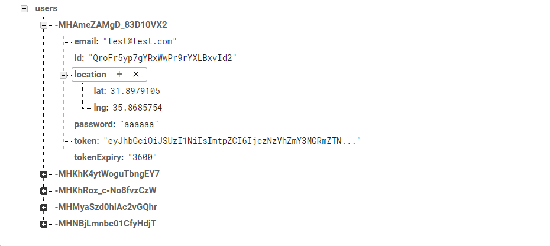
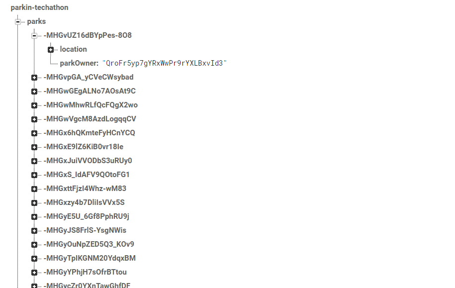
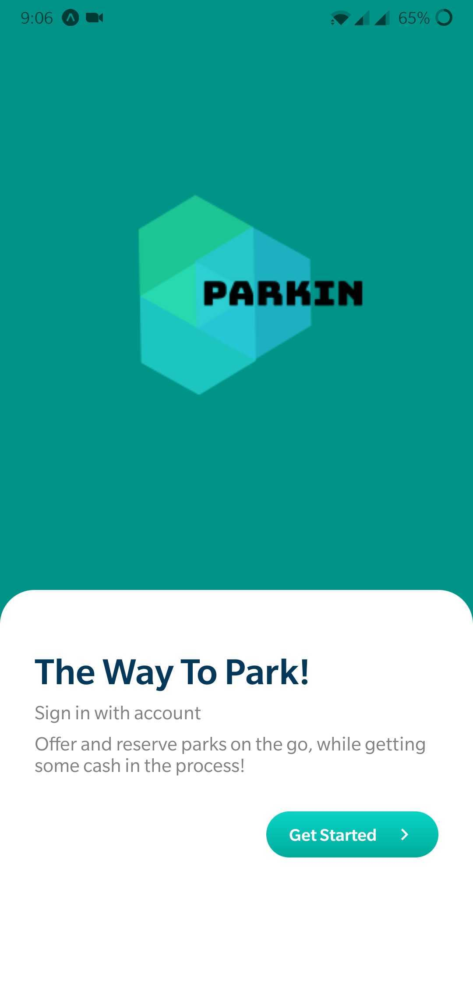
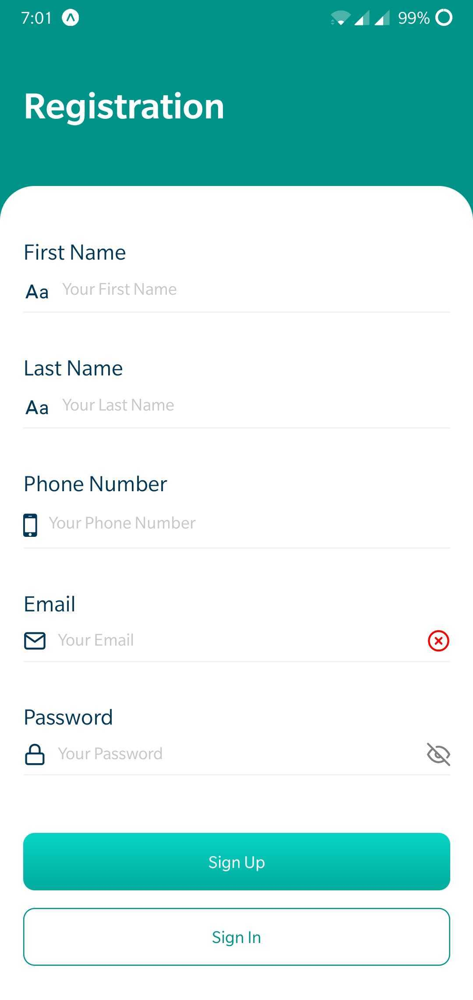
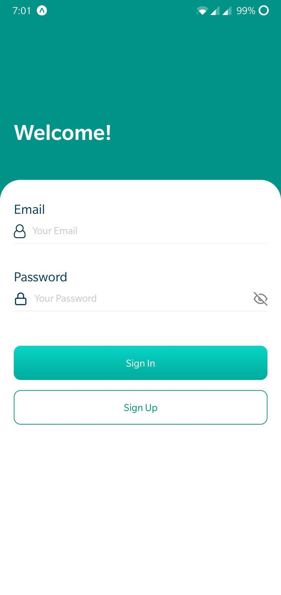
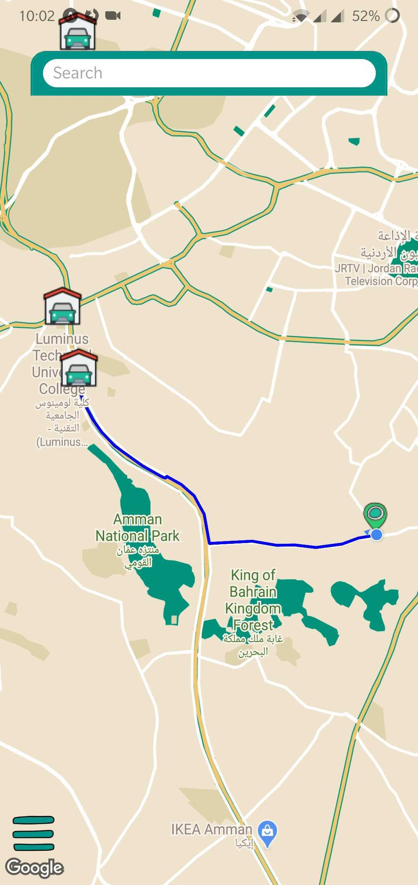

# Project ParkIn

* Team Members:

    - Muhammed Tommalieh
    - Obada Tumah
    - Yazan Alaiwah

- Most households with parking lot owners leave everyday in the morning to pursue their jobs, studies, appointments ...etc, which leaves those parking lots empty and without use for around 9 hours daily. Also lots of public parking lots are unknown to people which make them unusable if people don’t know about them.

- In response ParkIn comes to allow those owners to offer those parking lots for rent and get paid per period of time by others who’re looking for a place to park safely and in time.

- Our business model revolves around parking lot owners getting paid for providing their unused parking lots for a certain amount of cash per period of time provided, which will allow individuals to find a parking lot near their destination with ease and prior of time, without missing out on your important schedule or getting a ticket for illegal parking.

- Given that a user opens the application in their mobile they will be introduced with the applications landing page Then the application will allow them to know more and navigate through the pages with easy accessability.

* User Stories

- As a user, I want to be able to offer my park for reservation by others.
- As a user, I want to be able to see all available parks.
- As a user, I want to be able to see all the information related to a certain park represented in a user friendly UI.
- As a user, I want to be able to search for parks that are closest to a certain location.
- As a user, I want to be able to reserve a park easilyy with no hussle.
- As a user, I want to be navigated to the park i selected with no need of using another application.

* Technologies Used

- Frontend
  - React
  - React Native
  - Expo

- Backend
  - Firebase for real time database
  - Firebase for authentication

* Challenges
  - Learned React Native on the spot for the competition
  - Remote development due to COVID
  - Limited time to apply the idea 

* Didn't make the cut
  - A fully functional push notification system for both parts of the process (we had the code ready but we faced a bug that we didn't have enough time to solve)
  - A more comprehensive routing behaviour that shows more details
  - A pricing plan

* Note: Some static data were used, although we had components to harvest these data but didn't handle storing it due to time limitation

* DB Relationship Diagram

* Application Screens 

